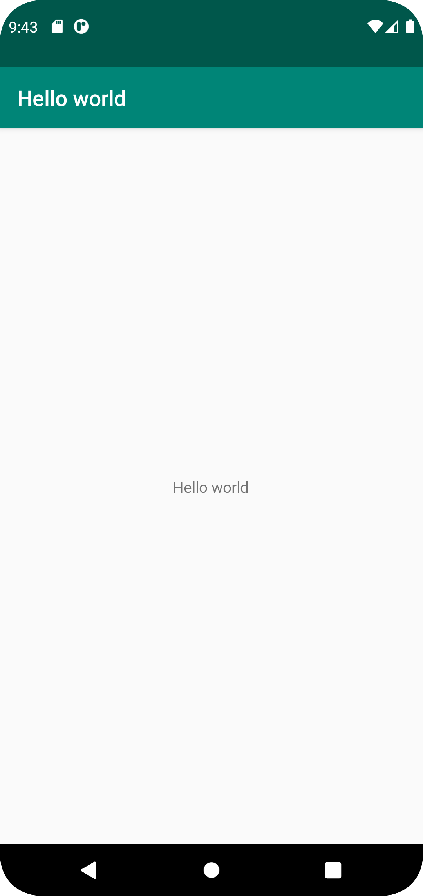

INLÄMNING 1

Jag har bytt text genom string till Hello world genom att använda mig utav string filen där jag enkelt kunnat navigera mig fram till vart texten >HELLO< 
befinner sig, för att kunna förstå vart man kan ändra texten i appen.

Hänvisar till kod nedanför:
<resources>
<string name="app_name">Hello world</string>
</resources>

string name='app_name' hänvisar till fil namn, stringen >hello world< hänvisar till text i stringen. 

-Bilder läggs i samma mapp som markdown-filen.

 
